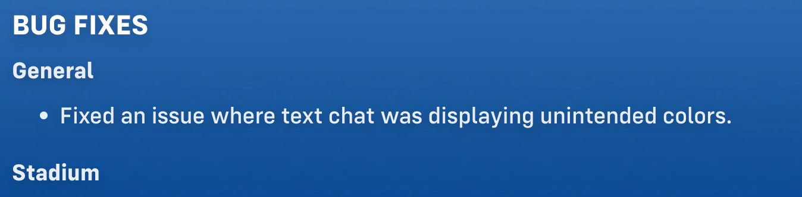
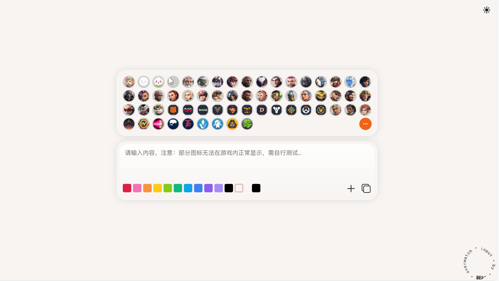
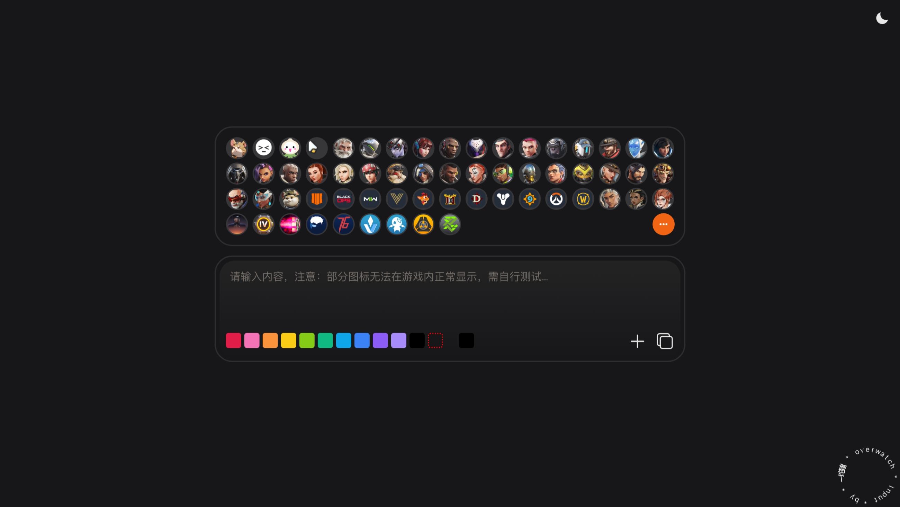
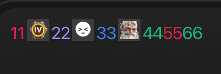

# overwatch-input




# ⚠️ This project is no longer maintained

**Notice: This project is no longer maintained and will not receive new updates or bug fixes. If you are interested, feel free to fork and continue development. Thank you for your support!**


overwatch text generator



INPUT：



OUTPUT：

```
<FGe11d48FF>11</FGe11d48FF>
<TXC0000000006256A>
<FGa78bfaFF>22</FGa78bfaFF>
<TXC0000000002A9FE>
<FG3b82f6FF>33</FG3b82f6FF>
<TXC00000000038491>
<FG10b981FF>44</FG10b981FF>
<FGe11d48FF>55</FGe11d48FF>
<FG10b981FF>66</FG10b981FF>
```
